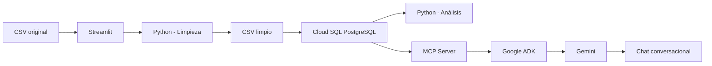

# Documentación Técnica
## Práctica 1 – Sistemas Organizacionales y Gerenciales 2
### Análisis de Ventas Online 2025

## 1. Objetivo

El proyecto implementa una solución de análisis de datos para un archivo de ventas online del año 2025.

El flujo completo es:



La solución permite:

- Cargar un CSV desde una interfaz gráfica.
- Limpiar y normalizar datos con Python.
- Guardar el resultado limpio en PostgreSQL sobre Google Cloud SQL.
- Consultar los datos directamente desde Cloud SQL.
- Mostrar estadísticas y visualizaciones.
- Exponer herramientas mediante MCP.
- Consumir MCP desde Google ADK.
- Realizar preguntas en lenguaje natural con Gemini.

---

## 2. Arquitectura

| Componente | Tecnología | Función |
|---|---|---|
| Infraestructura | Terraform | Crea Cloud SQL, base y usuario |
| Base de datos | PostgreSQL / Cloud SQL | Guarda los datos limpios |
| Conexión local | Cloud SQL Auth Proxy | Conecta localhost con Cloud SQL |
| Limpieza | Python + Pandas | Corrige, normaliza e imputa datos |
| Frontend | Streamlit | Carga CSV, ejecuta limpieza y carga a BD |
| Dashboard | Streamlit | Presenta estadísticas y gráficas |
| Acceso a BD | SQLAlchemy + psycopg2 | Consultas e inserciones |
| MCP | Python MCP SDK | Expone herramientas de análisis |
| Agente | Google ADK | Orquesta Gemini y MCP |
| IA | Gemini 2.5 Flash | Interpreta preguntas y utiliza herramientas |

---

## 3. Estructura del proyecto

```text
SOG2-2S26_Grupo1/
│
├── infra/
│   └── terraform/
│       ├── versions.tf
│       ├── provider.tf
│       ├── variables.tf
│       ├── main.tf
│       ├── outputs.tf
│       ├── terraform.tfvars
│       └── .gitignore
│
└── Practica 1/
    ├── app/
    │   ├── app.py
    │   ├── database.py
    │   ├── analisis.py
    │   └── pages/
    │       └── 2_Dashboard.py
    │
    ├── python/
    │   ├── 01_limpieza_datos.py
    │   ├── 02_analisis_datos.py
    │   └── requirements.txt
    │
    ├── r/
    │   ├── 01_limpieza_datos.R
    │   ├── 02_analisis_datos.R
    │   └── instalar_paquetes.R
    │
    ├── mcp_server/
    │   ├── server.py
    │   └── test_server.py
    │
    ├── ventas_agent/
    │   ├── __init__.py
    │   └── agent.py
    │
    ├── data/
    │   ├── ventas_online_2025.csv
    │   ├── ventas_online_2025_limpio.csv
    │   └── reporte_limpieza.txt
    │
    ├── sql/
    │   └── schema.sql
    │
    ├── .env
    ├── .venv/
    └── README.md
```

---

## 4. Infraestructura con Terraform

Proyecto GCP:

```text
sog2-2s26-grupo1-pra1
```

Región:

```text
us-central1
```

Instancia:

```text
sog2-pra1-postgres
```

Base de datos:

```text
ventas_sog2
```

Usuario:

```text
sog2_app
```

Configuración utilizada:

```text
PostgreSQL 15
db-f1-micro
10 GB HDD
ZONAL
Enterprise
Backups deshabilitados para la práctica
```

### `versions.tf`

```hcl
terraform {
  required_version = ">= 1.5.0"

  required_providers {
    google = {
      source = "hashicorp/google"
    }
  }
}
```

### `provider.tf`

```hcl
provider "google" {
  project = var.project_id
  region  = var.region
}
```

### `variables.tf`

```hcl
variable "project_id" {
  description = "ID del proyecto de GCP"
  type        = string
}

variable "region" {
  description = "Region de GCP"
  type        = string
  default     = "us-central1"
}

variable "instance_name" {
  description = "Nombre de la instancia Cloud SQL"
  type        = string
  default     = "sog2-pra1-postgres"
}

variable "database_name" {
  description = "Nombre de la base PostgreSQL"
  type        = string
  default     = "ventas_sog2"
}

variable "database_user" {
  description = "Usuario de la aplicacion"
  type        = string
  default     = "sog2_app"
}

variable "database_password" {
  description = "Password del usuario PostgreSQL"
  type        = string
  sensitive   = true
}
```

### `main.tf`

```hcl
resource "google_project_service" "sqladmin" {
  project = var.project_id
  service = "sqladmin.googleapis.com"

  disable_on_destroy = false
}

resource "google_sql_database_instance" "postgres" {
  name             = var.instance_name
  project          = var.project_id
  region           = var.region
  database_version = "POSTGRES_15"

  deletion_protection = false

  settings {
    tier              = "db-f1-micro"
    edition           = "ENTERPRISE"
    availability_type = "ZONAL"

    disk_type       = "PD_HDD"
    disk_size       = 10
    disk_autoresize = false

    ip_configuration {
      ipv4_enabled = true
    }

    backup_configuration {
      enabled = false
    }

    user_labels = {
      proyecto = "sog2"
      practica = "pra1"
      grupo    = "grupo1"
    }
  }

  depends_on = [
    google_project_service.sqladmin
  ]
}

resource "google_sql_database" "ventas" {
  name     = var.database_name
  project  = var.project_id
  instance = google_sql_database_instance.postgres.name
}

resource "google_sql_user" "app" {
  name     = var.database_user
  project  = var.project_id
  instance = google_sql_database_instance.postgres.name
  password = var.database_password
}
```

### `terraform.tfvars`

```hcl
project_id    = "sog2-2s26-grupo1-pra1"
region        = "us-central1"
instance_name = "sog2-pra1-postgres"
database_name = "ventas_sog2"
database_user = "sog2_app"
```

La contraseña no debe guardarse en el repositorio.

```bash
read -s -p "Password PostgreSQL: " TF_VAR_database_password
echo
export TF_VAR_database_password
```

### Comandos Terraform

```bash
terraform init
terraform fmt
terraform validate
terraform plan
terraform plan -out=tfplan
terraform apply tfplan
terraform output
```

Para eliminar la infraestructura cuando ya no se necesite:

```bash
terraform destroy
```

---

## 5. Cloud SQL Auth Proxy

Se utiliza el proxy para acceder a Cloud SQL mediante:

```text
127.0.0.1:5432
```

Arranque:

```bash
cloud-sql-proxy \
  sog2-2s26-grupo1-pra1:us-central1:sog2-pra1-postgres
```

Salida esperada:

```text
Listening on 127.0.0.1:5432
The proxy has started successfully and is ready for new connections!
```

Esta terminal debe permanecer abierta mientras Streamlit, MCP o ADK necesiten acceder a PostgreSQL.

---

## 6. Configuración `.env`

Archivo:

```text
Practica 1/.env
```

Ejemplo:

```env
DB_HOST=127.0.0.1
DB_PORT=5432
DB_NAME=ventas_sog2
DB_USER=sog2_app
DB_PASSWORD=CAMBIAR_POR_LA_PASSWORD_REAL
```

No subir `.env` a Git.

---

## 7. Tabla PostgreSQL

```sql
CREATE TABLE IF NOT EXISTS ventas_online_2025 (
    id_cliente    INTEGER,
    edad          NUMERIC,
    genero        INTEGER,
    venta_total   NUMERIC(18,2),
    n_compras     INTEGER,
    fecha_compra  DATE,
    monto_compra  NUMERIC(18,2),
    metodo_pago   INTEGER,
    tiempo        NUMERIC,
    navegador     INTEGER,
    boletin       INTEGER,
    vale          INTEGER
);
```

---

## 8. Limpieza de datos

Archivo:

```text
python/01_limpieza_datos.py
```

Responsabilidades:

1. Leer CSV.
2. Normalizar columnas.
3. Eliminar duplicados.
4. Convertir tipos.
5. Validar reglas.
6. Imputar datos.
7. Generar CSV limpio.
8. Generar reporte.

Reglas:

```text
Genero:
0 = Masculino
1 = Femenino

MetodoPago:
0 = Efectivo
1 = Tarjeta de Crédito
2 = Tarjeta de Débito

Navegador:
0 = Tienda Física
1 = Navegador 1
2 = Navegador 2
3 = Navegador 3
4 = Navegador 4

Boletin / Vale:
0 = No
1 = Sí
```

Tratamiento:

```text
Duplicados exactos              -> eliminar
Numéricos faltantes/invalidos   -> mediana
Categóricos faltantes/invalidos -> moda
Fechas inválidas                -> eliminar fila
Montos negativos                -> inválidos
```

Resultado validado:

```text
Filas originales: 1008
Duplicados eliminados: 5
Filas finales: 1003
```

---

## 9. Capa de base de datos

Archivo:

```text
app/database.py
```

Código principal:

```python
import os
from pathlib import Path

import pandas as pd
from dotenv import load_dotenv
from sqlalchemy import create_engine, text
from sqlalchemy.engine import URL

BASE_DIR = Path(__file__).resolve().parent.parent
load_dotenv(BASE_DIR / ".env")


def obtener_engine():
    url = URL.create(
        drivername="postgresql+psycopg2",
        username=os.getenv("DB_USER"),
        password=os.getenv("DB_PASSWORD"),
        host=os.getenv("DB_HOST"),
        port=int(os.getenv("DB_PORT", "5432")),
        database=os.getenv("DB_NAME"),
    )

    return create_engine(
        url,
        pool_pre_ping=True
    )


def probar_conexion():
    engine = obtener_engine()

    with engine.connect() as conexion:
        conexion.execute(text("SELECT 1"))

    return True


def cargar_csv_limpio(ruta_csv):
    df = pd.read_csv(ruta_csv)

    df = df.rename(columns={
        "Id_cliente": "id_cliente",
        "Edad": "edad",
        "Genero": "genero",
        "Venta_total": "venta_total",
        "N_Compras": "n_compras",
        "FechaCompra": "fecha_compra",
        "MontoCompra": "monto_compra",
        "MetodoPago": "metodo_pago",
        "Tiempo": "tiempo",
        "Navegador": "navegador",
        "Boletin": "boletin",
        "Vale": "vale",
    })

    df["fecha_compra"] = pd.to_datetime(
        df["fecha_compra"]
    ).dt.date

    engine = obtener_engine()

    with engine.begin() as conexion:
        conexion.execute(
            text("TRUNCATE TABLE ventas_online_2025")
        )

        df.to_sql(
            "ventas_online_2025",
            conexion,
            if_exists="append",
            index=False,
            method="multi",
            chunksize=500
        )

    return len(df)


def contar_registros():
    engine = obtener_engine()

    with engine.connect() as conexion:
        cantidad = conexion.execute(
            text("SELECT COUNT(*) FROM ventas_online_2025")
        ).scalar()

    return cantidad
```

---

## 10. Análisis desde Cloud SQL

Archivo:

```text
app/analisis.py
```

Ejemplo de lectura:

```python
def obtener_datos():
    engine = obtener_engine()

    consulta = """
        SELECT
            id_cliente,
            edad,
            genero,
            venta_total,
            n_compras,
            fecha_compra,
            monto_compra,
            metodo_pago,
            tiempo,
            navegador,
            boletin,
            vale
        FROM ventas_online_2025
        ORDER BY fecha_compra
    """

    df = pd.read_sql(
        consulta,
        engine
    )

    df["fecha_compra"] = pd.to_datetime(
        df["fecha_compra"]
    )

    return df
```

Funciones principales:

```text
obtener_datos()
estadisticas_basicas()
ventas_por_mes()
ventas_por_metodo_pago()
ventas_por_navegador()
```

---

## 11. Frontend Streamlit

Archivo:

```text
app/app.py
```

Responsabilidades:

- Cargar CSV.
- Mostrar vista previa.
- Ejecutar limpieza.
- Mostrar reporte.
- Descargar CSV limpio.
- Probar conexión con Cloud SQL.
- Cargar el CSV limpio a PostgreSQL.

Levantar:

```bash
streamlit run app/app.py
```

Abrir:

```text
http://localhost:8501
```

---

## 12. Dashboard

Archivo:

```text
app/pages/2_Dashboard.py
```

Presenta:

- Registros.
- Clientes.
- Ventas.
- Ticket promedio.
- Media, mediana, moda y desviación estándar.
- Ventas por mes.
- Ventas por método de pago.
- Ventas por navegador.
- Edad vs venta total.
- Ventas por género.
- Ventas según boletín.
- Ventas según vale.
- Uso de boletines y vales por mes.

---

## 13. MCP Server

Archivo:

```text
mcp_server/server.py
```

Servidor:

```python
from mcp.server.fastmcp import FastMCP

mcp = FastMCP("sog2-ventas-mcp")
```

Herramientas:

```text
resumen_general
obtener_estadisticas_basicas
consultar_ventas_por_mes
consultar_ventas_por_metodo_pago
consultar_ventas_por_navegador
consultar_correlacion_edad_venta
consultar_ventas_por_genero
consultar_segmentacion_edad
consultar_boletines_vales_por_mes
```

Ejemplo:

```python
@mcp.tool()
def resumen_general() -> dict:
    df = obtener_datos()

    return {
        "registros": int(len(df)),
        "clientes_unicos": int(df["id_cliente"].nunique()),
        "ventas_totales": round(
            float(df["monto_compra"].sum()),
            2,
        ),
        "ticket_promedio": round(
            float(df["monto_compra"].mean()),
            2,
        ),
    }
```

El servidor utiliza `stdio`:

```python
if __name__ == "__main__":
    mcp.run(transport="stdio")
```

---

## 14. Prueba del MCP

```bash
cd mcp_server
python test_server.py
```

Resultado validado:

```text
Herramientas MCP disponibles:
- resumen_general
- obtener_estadisticas_basicas
- consultar_ventas_por_mes
- consultar_ventas_por_metodo_pago
- consultar_ventas_por_navegador
- consultar_correlacion_edad_venta
- consultar_ventas_por_genero
- consultar_segmentacion_edad
- consultar_boletines_vales_por_mes
```

Resumen validado:

```json
{
  "registros": 1003,
  "clientes_unicos": 1000,
  "ventas_totales": 1204413.77,
  "ticket_promedio": 1200.81
}
```

---

## 15. Google ADK

Estructura:

```text
ventas_agent/
├── __init__.py
└── agent.py
```

`__init__.py`:

```python
from .agent import root_agent
```

`agent.py`:

```python
import sys
from pathlib import Path

from google.adk.agents import Agent
from google.adk.tools.mcp_tool.mcp_toolset import McpToolset
from google.adk.tools.mcp_tool import StdioConnectionParams
from mcp import StdioServerParameters

BASE_DIR = Path(__file__).resolve().parent.parent
MCP_SERVER = BASE_DIR / "mcp_server" / "server.py"

mcp_tools = McpToolset(
    connection_params=StdioConnectionParams(
        server_params=StdioServerParameters(
            command=sys.executable,
            args=[str(MCP_SERVER)],
        ),
        timeout=30,
    )
)

root_agent = Agent(
    name="analista_ventas_sog2",
    model="gemini-2.5-flash",
    description=(
        "Agente conversacional para análisis de ventas online 2025."
    ),
    instruction="""
Eres un analista de datos Junior para la práctica de
Sistemas Organizacionales y Gerenciales 2.

Tu información debe provenir de las herramientas MCP disponibles.
No inventes cifras.

Utiliza las herramientas adecuadas para responder preguntas sobre:

- estadísticas básicas;
- ventas por mes;
- métodos de pago;
- navegador o canal;
- segmentación por edad;
- comparación por género;
- correlación entre edad y venta total;
- boletines y vales;
- resumen general de ventas.

Cuando el usuario solicite un dato disponible en las herramientas,
consulta primero la herramienta correspondiente.

Responde en español de forma clara y breve.
Si los datos disponibles no permiten responder algo, indícalo.
""",
    tools=[mcp_tools],
)
```

---

## 16. APIs GCP

```bash
gcloud services enable serviceusage.googleapis.com \
  --project=sog2-2s26-grupo1-pra1

gcloud services enable sqladmin.googleapis.com \
  --project=sog2-2s26-grupo1-pra1

gcloud services enable aiplatform.googleapis.com \
  --project=sog2-2s26-grupo1-pra1
```

---

## 17. Variables Google ADK

```bash
export GOOGLE_GENAI_USE_VERTEXAI=TRUE
export GOOGLE_CLOUD_PROJECT=sog2-2s26-grupo1-pra1
export GOOGLE_CLOUD_LOCATION=us-central1
```

---

## 18. Cómo levantar todo el ambiente

### Terminal 1 – Cloud SQL Proxy

```bash
cd "/home/ronaldo-lara/Documentos/SOG2-2S26_Grupo1/Practica 1"

cloud-sql-proxy \
  sog2-2s26-grupo1-pra1:us-central1:sog2-pra1-postgres
```

Mantener esta terminal abierta.

### Terminal 2 – Streamlit

```bash
cd "/home/ronaldo-lara/Documentos/SOG2-2S26_Grupo1/Practica 1"

source .venv/bin/activate

streamlit run app/app.py
```

Abrir:

```text
http://localhost:8501
```

### Terminal 3 – Google ADK

```bash
cd "/home/ronaldo-lara/Documentos/SOG2-2S26_Grupo1/Practica 1"

source .venv/bin/activate

export GOOGLE_GENAI_USE_VERTEXAI=TRUE
export GOOGLE_CLOUD_PROJECT=sog2-2s26-grupo1-pra1
export GOOGLE_CLOUD_LOCATION=us-central1

adk web --port 8001
```

Abrir:

```text
http://127.0.0.1:8001
```

Seleccionar:

```text
ventas_agent
```

Orden recomendado:

```text
1. Cloud SQL Proxy
2. Streamlit
3. ADK Web
```

No es necesario ejecutar manualmente:

```bash
python mcp_server/server.py
```

ADK inicia el MCP Server por `stdio`.

---

## 19. Pruebas

Base:

```sql
SELECT COUNT(*)
FROM ventas_online_2025;
```

Resultado esperado para el archivo utilizado:

```text
1003
```

MCP:

```bash
cd mcp_server
python test_server.py
```

Preguntas ADK:

```text
¿Cuántos registros hay en la base?
¿Cuál fue el mes con mayores ventas?
¿Cómo se comportan las ventas por género?
¿Cuál fue el método de pago con mayores ventas?
¿Existe correlación entre la edad y la venta total?
¿En qué meses se utilizaron más vales?
```

---

## 20. Detener el ambiente

Streamlit:

```text
Ctrl + C
```

ADK:

```text
Ctrl + C
```

Proxy:

```text
Ctrl + C
```

---

## 21. Dependencias

```text
streamlit
pandas
numpy
matplotlib
scipy
sqlalchemy
psycopg2-binary
python-dotenv
google-adk
mcp
```

Instalación:

```bash
pip install \
  streamlit \
  pandas \
  numpy \
  matplotlib \
  scipy \
  sqlalchemy \
  psycopg2-binary \
  python-dotenv \
  "google-adk[mcp]"
```

---

## 22. Seguridad

- No subir `.env`.
- No subir contraseñas.
- No subir `terraform.tfstate`.
- No subir `tfplan`.
- Mantener secretos fuera del código.
- Usar Cloud SQL Auth Proxy para desarrollo local.
- Destruir infraestructura que ya no sea necesaria para evitar cobros.
